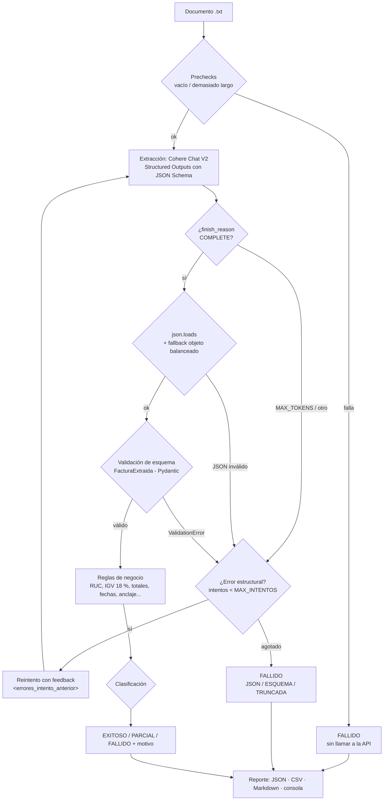
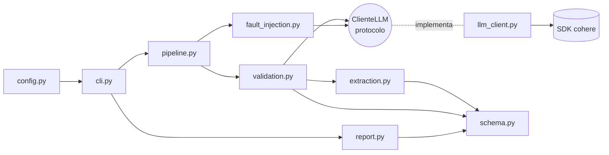

# extractor-facturas

Extractor de datos estructurados desde **facturas electrónicas peruanas (SUNAT)** en texto libre (PDF transcrito, OCR o correos de proveedores). Usa **Structured Outputs de Cohere** (JSON Schema) y validación programática robusta. Es el proyecto final de *Fundamentos de Arquitectura LLM*, Opción 3 ([enunciado](docs/ENUNCIADO.md)).

> El structured output es una técnica de **confiabilidad**, no de formato. Lo que se evalúa no es el camino feliz, sino qué pasa cuando el modelo devuelve algo que no calza con el esquema. **Cohere promete el 100 %, y aun así validamos.**

Por cada documento, el sistema devuelve un JSON validado y lo clasifica como **EXITOSO**, **PARCIAL** (requiere revisión humana) o **FALLIDO**, siempre con el motivo. Un documento que falla nunca detiene el lote.

## Resultados (corrida real con Cohere)

| Éxito total | Parcial | Fallido | Utilizable | Estado = esperado | Exactitud de campos clave |
|---|---|---|---|---|---|
| 6/11 (54.5 %) | 2/11 (18.2 %) | 3/11 (27.3 %) | 72.7 % | 11/11 | 100 % |

Ningún caso no exitoso se debe a un error del modelo. Todos vienen de la **fuente**: información ausente o ilegible, un documento fuera de dominio o un error del emisor. La recuperación ante un JSON inválido y el límite de intentos se demuestran con inyección de fallos determinista. Detalle en [docs/RESULTADOS.md](docs/RESULTADOS.md).

## Flujo



Los **campos faltantes no se reintentan**: si el dato no está en la fuente, reintentar solo gasta tokens. Solo se reintenta lo estructural (formato y tipos), que sí es corregible.

## Módulos



- **Solo `llm_client.py` importa `cohere`.** El resto depende del protocolo `ClienteLLM`.
- **`schema.py` no importa nada del proyecto.**

Ambas reglas se verifican con un test basado en AST (`tests/test_seguridad.py`).

| Módulo | Responsabilidad |
|---|---|
| `schema.py` | Modelos Pydantic: `FacturaExtraida` (permisivo, para el LLM), `FacturaValidada` (estricto, para el negocio), enums y modelos de resultado |
| `extraction.py` | Prompt de sistema versionado, mensajes con delimitadores y feedback, esquema para `response_format` |
| `llm_client.py` | `ClienteCohere`, mapeo de errores, reintentos de transporte del SDK y limitador de tasa |
| `validation.py` | `finish_reason` → JSON → Pydantic, reintentos de formato con límite, reglas de negocio y clasificación |
| `fault_injection.py` | `ClienteConFallas`: inyección de fallos determinista (solo con `--simular-fallo`) |
| `pipeline.py` | Lote con aislamiento por documento, prechecks, circuit breaker y Ctrl+C |
| `report.py` | Métricas, comparación con `esperado.json`, `resultados.json`, `reporte.csv`, `reporte.md` y consola |
| `cli.py` | Comandos `procesar`, `extraer` y `esquema` |

## Instalación

Requiere Python 3.11 o superior. Todas las dependencias tienen la versión fijada en `pyproject.toml`.

```bash
python3.12 -m venv .venv
```

```bash
source .venv/bin/activate
```

```bash
pip install -e ".[dev]"
```

## Configuración: key de prueba de Cohere

1. Crea una cuenta gratuita en [dashboard.cohere.com](https://dashboard.cohere.com) e inicia sesión.
2. En **API Keys** ([dashboard.cohere.com/api-keys](https://dashboard.cohere.com/api-keys)), copia la *Trial key* que se crea por defecto, o genera una nueva. Es gratuita y admite **20 llamadas por minuto y 1.000 por mes**.
3. Crea tu `.env` desde la plantilla y pega la key en `COHERE_API_KEY` con tu editor:

```bash
cp .env.example .env
```

| Variable | Default | Descripción |
|---|---|---|
| `COHERE_API_KEY` | — (obligatoria) | Se maneja como `SecretStr` y nunca se imprime. Si falta, el programa sale con un mensaje claro |
| `MODELO` | `command-a-03-2025` | Alternativa: `command-a-plus-05-2026`. `command-r7b` se rechaza (no soporta Structured Outputs) |
| `MAX_INTENTOS` | `3` | Total de llamadas de formato (1 original + reintentos). Rango 1–5 |
| `INTERVALO_MIN_S` | `3.1` | Segundos mínimos entre llamadas, por la cuota de la key de prueba |
| `MAX_TOKENS` | `2048` | Salida máxima por llamada. Se duplica si la respuesta se trunca, con tope de 8192 |
| `TIMEOUT_S` | `60` | Timeout HTTP |
| `MAX_CHARS_DOCUMENTO` | `20000` | Los documentos más largos se rechazan sin llamar a la API |
| `TOLERANCIA_MONTOS` | `0.05` | Tolerancia de las reglas de negocio |

`.env` está en `.gitignore` y nunca se versiona.

## Uso

**Ver el JSON Schema enviado a Cohere** (y verificar que es compatible):

```bash
python -m extractor esquema
```

**Extraer un documento y ver cada intento** (pensado para la demo):

```bash
python -m extractor extraer data/documentos/01_factura_estandar.txt --verbose
```

**Procesar el lote completo** (reportes en `output/`):

```bash
python -m extractor procesar data/documentos
```

Opciones de `procesar`: `--max-intentos N`, `--simular-fallo MODO`, `--simular-en PATRON_GLOB` y `--salida CARPETA`. Los logs van a `logs/extractor.log` (gitignored); el texto completo del documento solo se registra con `--verbose`.

## Demo de fallos (inyección determinista)

Structured Outputs rara vez falla en una demo, así que `--simular-fallo` envuelve al cliente real y corrompe su salida de forma determinista. Nunca está activo por defecto, muestra el banner `[SIMULACIÓN: modo]` y escribe en `output/simulaciones/<modo>/`, sin pisar la corrida oficial.

| Modo | Qué hace | Qué demuestra |
|---|---|---|
| `json_invalido` | Trunca el JSON en los primeros `min(2, max_intentos − 1)` intentos | **Recuperación** con feedback |
| `tipo_incorrecto` | 1.er intento con `total` y `fecha_emision` en texto | `ValidationError` → reintento → recuperación |
| `persistente` | Corrompe siempre | **Límite** de intentos: FALLIDO sin caer el lote |
| `sin_json` | 1.er intento en prosa sin JSON | El fallback falla y se reintenta |

**Recuperación** de un JSON inválido:

```bash
python -m extractor extraer data/documentos/01_factura_estandar.txt --simular-fallo json_invalido --verbose
```

**Límite alcanzado**, con el fallo aislado y el resto del lote siguiendo:

```bash
python -m extractor procesar data/documentos --simular-fallo persistente --simular-en "03*" --max-intentos 2
```

## Tests

```bash
pytest -q
```

261 tests, **ninguno llama a la API**: usan un `FakeClienteLLM` con respuestas guionadas y un transporte HTTP simulado. Cubren el esquema (incluida la compatibilidad con Cohere), los reintentos (el conteo exacto de llamadas prueba que no hay bucle infinito), la inyección de fallos, cada regla de negocio, la clasificación, el pipeline (aislamiento, prechecks y circuit breaker), los reportes, la CLI, la seguridad y la arquitectura.

## Documentación

- [docs/ESQUEMA.md](docs/ESQUEMA.md): campos, tipos, validaciones, esquema doble y umbrales.
- [docs/DECISIONES.md](docs/DECISIONES.md): 19 ADR, incluido el cambio de proveedor.
- [docs/RESULTADOS.md](docs/RESULTADOS.md): corridas reales, comparación con lo esperado y patrón de fallos.

